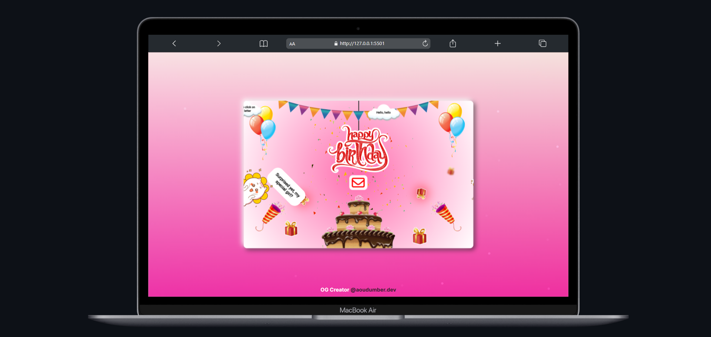

# 🎂✨ Interactive Happy Birthday Website ✨💻
*A premium, highly interactive birthday celebration website designed to create memorable surprises.*


*Watch the project in action on [Instagram](https://www.instagram.com/the.cipher.stack?igsh=dmdnbGNzbDNpZzlu)*

---

## 🌟 **Features**
This project is a beautifully crafted, responsive web page built to celebrate birthdays in a unique, digital way. It includes:
- **Interactive Birthday Card**: A simulated letter envelope that dynamically opens on click.
- **Typewriter Effect**: A custom-scripted typewriter animation that reveals the letter content character-by-character in a clean monospaced font.
- **Cake Celebration Overlay**: A clickable cake that launches a stunning romantic full-screen celebration overlay, featuring floating heart particles and a continuous gradient-colored confetti/fireworks display.
- **Aesthetic Elements**: Floating balloon animations, interactive mouse-trail heart effects, and smooth layout transitions.

---

## 🛠️ **Tech Stack**
- **HTML5**: Structured semantic markup.
- **CSS3**: Premium custom styling, smooth transitions, and keyframe animations.
- **JavaScript (ES6+)**: Custom particle engines, dynamic typewriter logic, and interaction controllers.
- **Canvas-Confetti**: Integration of a high-performance particle confetti system.

---

## 🚀 **Getting Started & Customization**
To deploy this project or customize it for your own special events:

1. **Clone the Repository**:
   ```bash
   git clone https://github.com/the-cipher-stack/Happy-Birthday-Website.git
   ```

2. **Customize the Letter Content**:
   - Open `index.html`.
   - Modify the text inside the `<h2>` tag within the `.card2` container. The script will automatically detect the new text and type it out.

3. **Modify the Instagram Link**:
   - Update the link in `index.html` footer and `README.md` to your own profile link.

4. **Deploy**:
   - Upload the files to any web server, GitHub Pages, Netlify, or Vercel.

---

## 📬 **Connect & Support**
Developed and maintained by **The Cipher Stack**.

- **Instagram**: [@the.cipher.stack](https://www.instagram.com/the.cipher.stack?igsh=dmdnbGNzbDNpZzlu)
- **GitHub**: [Hxni786](https://github.com/Hxni786)

Feel free to fork this project, open issues, or submit pull requests to enhance the features!
